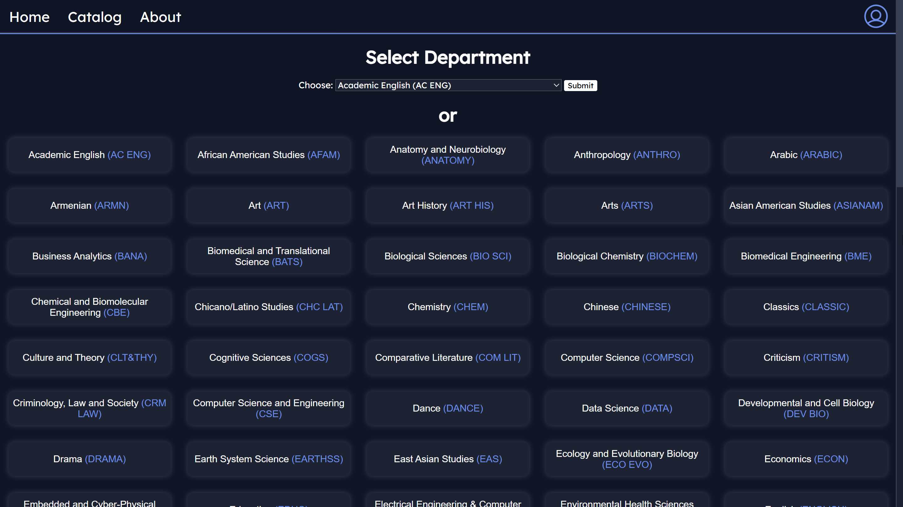
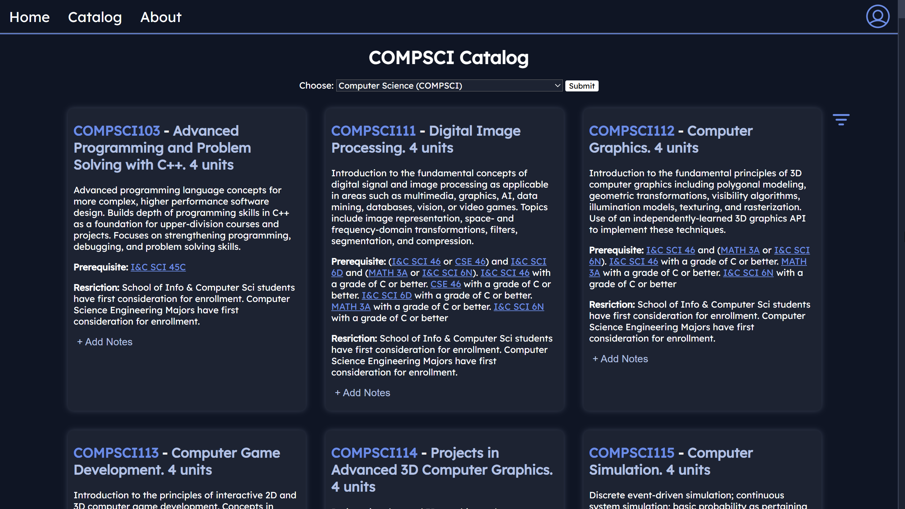
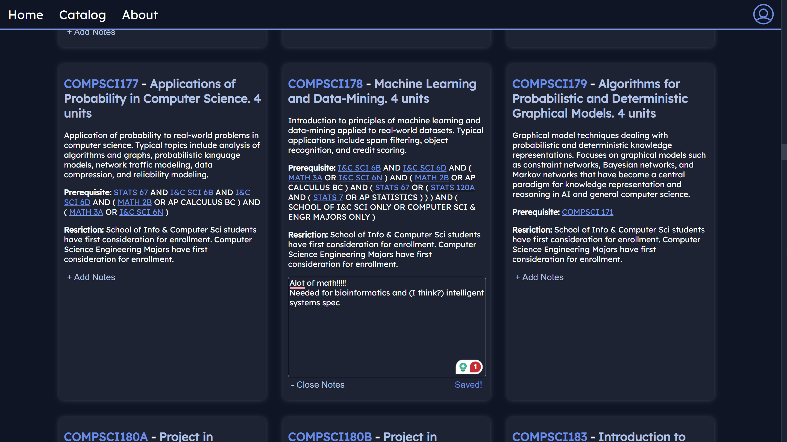
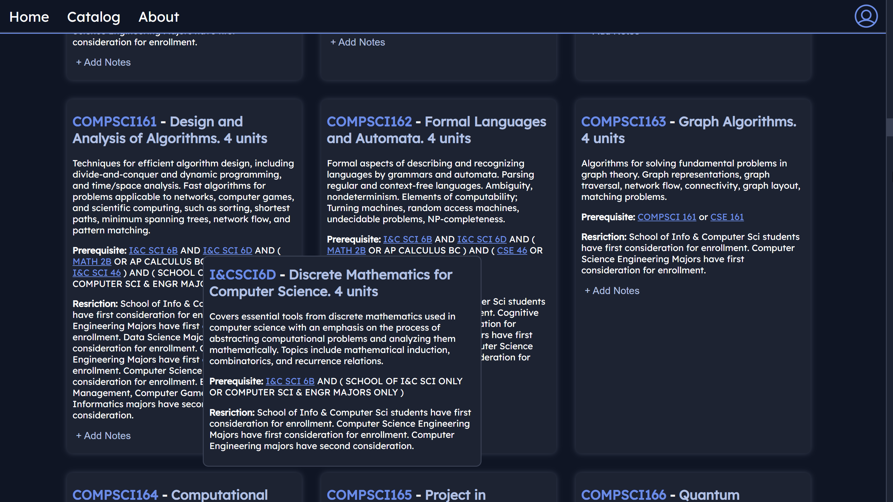

# AntMemo
A UCI course catalog alternative with a note-taking feature. Users can seamlessly browse through every course offered at UCI and jot down notes and info about each class. Users must log in to take notes as they are stored within SQL databases tied to each user. 

# Installation
No installation is required, the website can EVENTUALLY be accessed through a link! Still adding finishing touches and whatnot.

# Images

_Department selection screen, users can select a department through the dropdown menu or select one in the table below._\
\

_Course catalog screen, features every course offered at UCI_\
\

_AntMemo's note-taking feature, users can jot down notes and info about their classes given that they are logged in_\
\

_Course pop-up feature when clicking on course prerequisites_

# Future Updates
I have yet to upload this website as I got busy with packing/move-in, a conference, internship apps, etc. but I will add my finishing touches and upload it to a VPS with Docker when I get the time. I would also like to add different features to the app to help UCI students plan courses and view them more easily (e.g. AntAlmanac schedule importing, more view filters, etc.)
